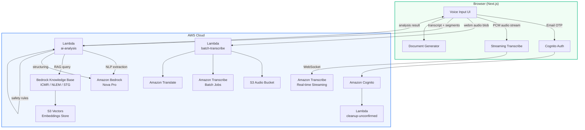
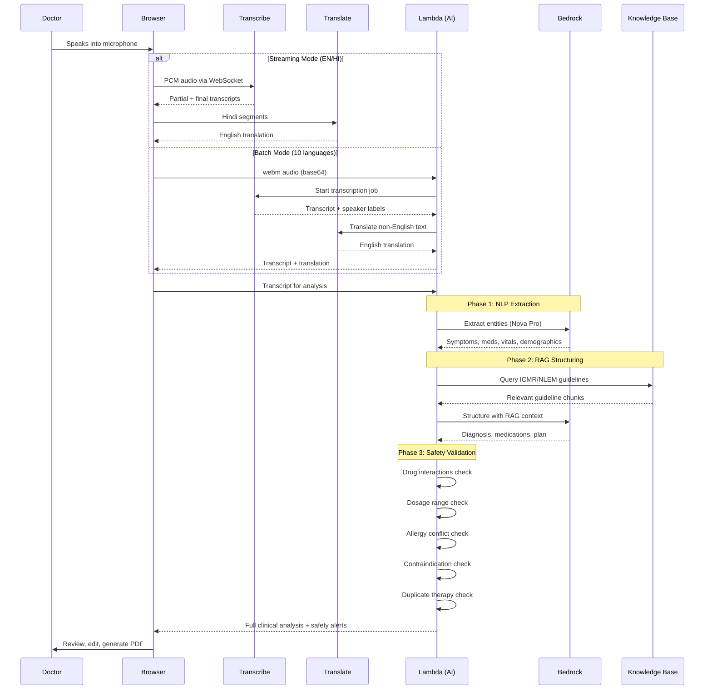
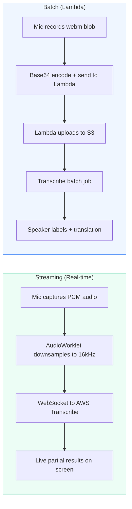
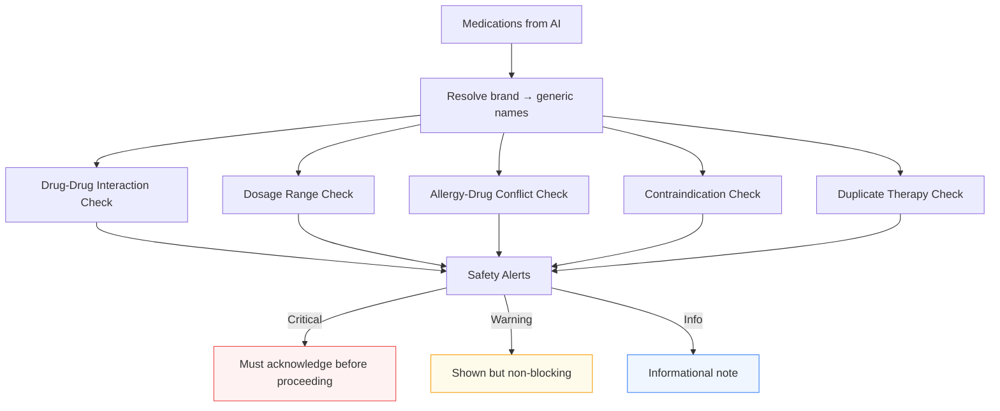

# Clinical Copilot

AI-powered clinical documentation assistant for Indian hospitals. Doctors speak in any Indian language, and the app turns their words into structured prescriptions, OPD notes, and safety-checked clinical records — in seconds.

## What It Does

Clinical Copilot sits between the doctor and the paperwork. It listens to doctor-patient conversations (or solo dictation), transcribes and translates in real time, runs AI analysis to extract diagnoses, medications, and vitals, checks for drug safety issues, and outputs ready-to-print PDFs.

No typing. No templates to fill. Just talk and get documents.

## Architecture

### High-Level Overview



### Request Flow: Voice to Prescription



## Features

### Voice Transcription

| Feature | Details |
|---|---|
| Real-time streaming | English and Hindi with live partial results |
| Batch transcription | Tamil, Telugu, Kannada, Malayalam, Bengali, Marathi, Gujarati, Punjabi |
| Auto language detection | Detects English/Hindi mix in real time |
| Speaker diarization | Separates doctor and patient voices in consultation mode |
| Translation | Auto-translates all languages to English |
| Filler word removal | Strips "um", "uh", "basically", etc. from transcripts |

### AI Analysis (3-Phase Pipeline)

**Phase 1 — NLP Extraction:**
Bedrock Nova Pro extracts symptoms, diagnoses, medications (Indian brand names like Dolo, Crocin, Azithral), vitals, allergies, and demographics from the transcript.

**Phase 2 — RAG Structuring:**
Queries a Bedrock Knowledge Base loaded with Indian medical references to validate and structure the extracted data. Maps to ICD-10 codes and ICMR guidelines.

**Phase 3 — Safety Validation:**
Runs local rule-based checks (no LLM needed) against bundled JSON datasets:

- Drug-drug interactions (e.g., Aspirin + Ibuprofen)
- Dosage range validation (min/max per dose)
- Allergy-drug conflicts (including drug class cross-reactivity)
- Contraindication checks (drug vs. condition)
- Duplicate therapy detection (same generic, different brands)
- Brand-to-generic name resolution (Indian brands)

### Knowledge Base

The RAG system is backed by Indian medical reference documents:

- **NLEM 2022** — National List of Essential Medicines (384 drugs)
- **ICMR Standard Treatment Workflows** — Diabetes, depression, headache, diarrhea, TB, liver failure, dermatophytoses, skin infections, male infertility
- **National Formulary of India 2016** — Full drug monographs
- **NHM Standard Treatment Guidelines** — Hypertension, snakebite
- **ICMR Antimicrobial Resistance Guidelines**

Documents are chunked (500 tokens, 20% overlap) and embedded with Titan Embed Text V2 into S3 Vectors.

### Document Generation

**5 prescription templates:** Classic, Modern Minimal, Clinical, Compact, Elegant

**5 OPD note templates:** SOAP Format, Two-Column, Structured Form, Systems Review, Progress Note

All templates render as HTML and export to PDF. Doctor info is editable per session. Data flows from AI analysis into the templates — no re-typing needed.

### Internationalization

The UI itself is translated into 10 languages:
English, Hindi, Tamil, Telugu, Kannada, Malayalam, Bengali, Marathi, Gujarati, Punjabi.

Locale is auto-detected and switchable at any time, including on the login screen.

## Project Structure

```
clinical-copilot/
├── app/
│   └── [locale]/
│       ├── layout.tsx              # Root layout with auth + i18n
│       └── page.tsx                # Main page
├── amplify/
│   ├── auth/resource.ts            # Cognito (email OTP)
│   ├── storage/resource.ts         # S3 audio bucket
│   ├── data/resource.ts            # AppSync schema (placeholder)
│   ├── backend.ts                  # IAM policies, KB setup, Lambda wiring
│   └── functions/
│       ├── ai-analysis/
│       │   ├── handler.ts          # 3-phase AI pipeline
│       │   ├── resource.ts         # Lambda config (300s, 1GB)
│       │   └── safety-rules/       # JSON datasets for drug checks
│       ├── batch-transcribe/
│       │   ├── handler.ts          # S3 upload → Transcribe → Translate
│       │   └── resource.ts         # Lambda config (120s, 512MB)
│       └── cleanup-unconfirmed/
│           ├── handler.ts          # Deletes stale unconfirmed users
│           └── resource.ts
├── components/
│   ├── ai-analysis/
│   │   ├── ai-analysis-panel.tsx   # Analysis modal with safety alerts
│   │   └── use-ai-analysis.ts      # Hook: invokes ai-analysis Lambda
│   ├── authenticator/
│   │   └── wrapper.tsx             # Amplify auth with 10-language UI
│   ├── document-generator/
│   │   ├── document-generator.tsx  # Template picker + PDF export
│   │   ├── prescription-templates.ts
│   │   ├── prescription-template-renderer.tsx
│   │   ├── opd-templates.ts
│   │   ├── opd-template-renderer.tsx
│   │   └── template-utils.ts       # Shared HTML helpers
│   ├── locale-switcher/
│   │   └── locale-switcher.tsx
│   └── voice-input/
│       ├── voice-input.tsx         # Main input component
│       ├── use-transcribe.ts       # Hook: real-time streaming
│       ├── use-batch-transcribe.ts # Hook: batch via Lambda
│       ├── use-translate.ts        # Hook: AWS Translate
│       ├── languages.ts            # Language definitions
│       └── pcm-processor.worklet.ts
├── constants/
│   ├── config.ts                   # AWS region, audio settings
│   ├── mappings.ts                 # Language labels, speaker labels
│   ├── errors.ts
│   └── ui-strings.ts
├── i18n/
│   ├── config.ts                   # 10 locales
│   ├── routing.ts                  # next-intl routing
│   └── request.ts
├── messages/                       # Translation JSON files per locale
├── types/
│   └── clinical-analysis.ts        # Shared TypeScript types
├── scripts/
│   ├── download-kb-docs.sh         # Downloads Indian medical PDFs
│   └── sync-kb-documents.sh        # Uploads to S3 + triggers KB ingestion
└── kb-documents/                   # Downloaded PDFs (gitignored)
```

## Tech Stack

| Layer | Technology |
|---|---|
| Frontend | Next.js 16, React 19, Tailwind CSS 4 |
| Auth | Amazon Cognito (email OTP, passwordless) |
| Voice | Amazon Transcribe (streaming + batch) |
| Translation | Amazon Translate |
| AI Model | Amazon Bedrock — Nova Pro v1 |
| Embeddings | Amazon Bedrock — Titan Embed Text V2 (1024d) |
| Vector Store | S3 Vectors |
| Knowledge Base | Amazon Bedrock Knowledge Bases |
| Storage | Amazon S3 |
| Compute | AWS Lambda (Node.js) |
| Infrastructure | AWS Amplify Gen 2, AWS CDK |
| i18n | next-intl |
| PDF | html2canvas + jsPDF |

## Getting Started

### Prerequisites

- Node.js 20+
- An AWS account with Bedrock model access enabled (Nova Pro, Titan Embed V2)
- AWS Amplify CLI (`npm install -g @aws-amplify/backend-cli`)

### Setup

```bash
# Clone and install
git clone <repo-url>
cd clinical-copilot
npm install

# Deploy the backend (Cognito, S3, Lambdas, Knowledge Base)
npx ampx sandbox

# Download medical reference documents
bash scripts/download-kb-docs.sh

# Upload docs to Knowledge Base
bash scripts/sync-kb-documents.sh

# Start the dev server
npm run dev
```

Open [http://localhost:3000](http://localhost:3000). You'll see the login screen — sign up with your email to get an OTP.

### Environment

No `.env` file is needed. All configuration comes from `amplify_outputs.json` (auto-generated by Amplify sandbox) and Lambda environment variables (set in `amplify/backend.ts`).

## How It Works (Step by Step)

1. **Doctor opens the app** and logs in with email OTP.
2. **Picks a mode** — Consultation (2-speaker) or Dictation (solo).
3. **Selects a language** and hits the mic button.
4. **Audio is transcribed** — streaming for English/Hindi, batch Lambda for other languages.
5. **Non-English text is translated** to English automatically.
6. **Doctor clicks "Analyze"** — transcript goes to the ai-analysis Lambda.
7. **AI extracts** symptoms, medications, vitals, demographics (Phase 1).
8. **RAG queries** Indian medical guidelines for validation (Phase 2).
9. **Safety engine** checks drug interactions, dosages, allergies, contraindications (Phase 3).
10. **Doctor reviews** the structured analysis — edits fields, acknowledges safety alerts.
11. **Picks a template** (prescription or OPD note) and fills in doctor details.
12. **Downloads PDF** — ready to print or share.

## Two Transcription Modes



**Streaming** is used for English and Hindi — gives instant feedback as the doctor speaks.

**Batch** is used for Tamil, Telugu, Kannada, Malayalam, Bengali, Marathi, Gujarati, and Punjabi. Records the full audio, then processes it through a Lambda that handles S3 upload, Transcribe job polling, and translation.

In consultation mode, batch always runs with speaker diarization to separate doctor and patient.

## Safety Engine

The safety engine runs entirely on local JSON rules — no LLM calls, no latency, deterministic results.



Brand-to-generic resolution handles Indian brand names (Dolo → Paracetamol, Ecosprin → Aspirin, Glycomet → Metformin, Pan D → Pantoprazole+Domperidone, etc.) so safety rules work regardless of whether the doctor uses brand or generic names.

## License

Private project. Not open source.
